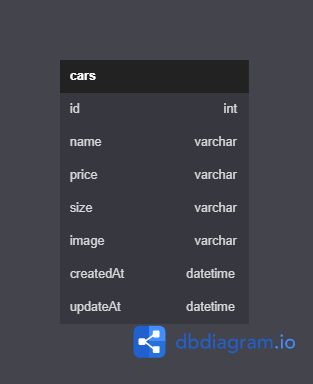

# Challange-5
Assalamualaikum Warahmatullahi Wabarakatuh, berikut hasil dari pengerjaan challange 5 saya mas hafidh,
Nama : Hendri Permana Putra
Kelas : FSW 1 / KM-3

# Car Management Dashboard


# Run
```
npm run start
```

# Database management
For database management, used MYSQL with tools PHPMYADMIN, and SEQUELIZE


#HOW TO START
##first --> clone and place all path to folder you want

##Second --> install xampp, because iam used MYSQL for my Database Management, and then create
```
Database name = "db_cars"
Table Name = "cars"
```

##Third --> Open file name "index.js" and enable or Uncomment this line code 
```
app.use(cors());
app.use(express.json());
app.set("view engine", "ejs");
app.use(bodyParser.urlencoded({ extended: true }));
app.use(bodyParser.json());
app.use(express.static("public"));
// import tblCars from "./models/userModels.js"; ---> This Line Code you Must Uncomment or Enabled
// import {addCars, getCars} from "./handler/controller.js";
// import ejs from "ejs";

+++++++++++++++++++++
In the same file, search this line code :
try {
    db.authenticate();
    console.log('Database was Connected...');
    // await tblCars.sync(); ---> Enabled to / Uncomment
} catch (error){
    console.error(Error);
}
```

###Fourth --> RUN with "npm run start", and wait until the servers start and create your table database with a field automatically, after that, you must comment again, the line code you uncomment before, let it not always load to create a table.

###Fifth --> and NOW, this website ready to use. :)


# Endpoint
### Get all cars list
http://localhost:8000/cars


##### Example request Body
```
let config = {
  method: 'get',
  url: 'http://localhost:8000/cars',
  headers: { }
};

axios(config)
.then(function (response) {
  console.log(JSON.stringify(response.data));
})
.catch(function (error) {
  console.log(error);
});

```
##### Output examples
```
[
  {
    "id": 42,
    "name": "Honda Civic",
    "price": "Rp 5.000.000,00",
    "size": "medium",
    "image": "image-1665213382703-399801290.png",
    "createdAt": "2022-10-08T07:16:22.000Z",
    "updatedAt": "2022-10-08T07:16:22.000Z"
  },
  {
    "id": 41,
    "name": "Alphard",
    "price": "Rp 1.000.000,00",
    "size": "medium",
    "image": "image-1665209605283-139974430.png",
    "createdAt": "2022-10-08T06:13:25.000Z",
    "updatedAt": "2022-10-08T06:13:25.000Z"
  }
]
```

---

### Get car by id
http://localhost:8000/cars/41


##### Example request body
```
let config = {
  method: 'get',
  url: 'http://localhost:8000/cars/41',
  headers: { }
};

axios(config)
.then(function (response) {
  console.log(JSON.stringify(response.data));
})
.catch(function (error) {
  console.log(error);
});
```

##### Output Example
```
  {
    "id": 41,
    "name": "Alphard",
    "price": "Rp 1.000.000,00",
    "size": "medium",
    "image": "image-1665209605283-139974430.png",
    "createdAt": "2022-10-08T06:13:25.000Z",
    "updatedAt": "2022-10-08T06:13:25.000Z"
  }
]
```
---

### Get car by size
http://localhost:8000/cars/filter/medium
##### Example request body
```
let config = {
  method: 'get',
  url: 'http://localhost:8000/cars/filter/medium',
  headers: { }
};

axios(config)
.then(function (response) {
  console.log(JSON.stringify(response.data));
})
.catch(function (error) {
  console.log(error);
});

```
##### Output Examples
```
[
  {
    "id": 41,
    "name": "Alphard",
    "price": "Rp 1.000.000,00",
    "size": "medium",
    "image": "image-1665209605283-139974430.png",
    "createdAt": "2022-10-08T06:13:25.000Z",
    "updatedAt": "2022-10-08T06:13:25.000Z"
  },
  {
    "id": 42,
    "name": "zuxi",
    "price": "Rp 5.000.000,00",
    "size": "medium",
    "image": "image-1665213382703-399801290.png",
    "createdAt": "2022-10-08T07:16:22.000Z",
    "updatedAt": "2022-10-08T07:16:22.000Z"
  }
]
```
---

### Post car
http://localhost:8000/cars

##### Example request body
```
let data = new FormData();
data.append('name', 'Porsche');
data.append('price', '200000');
data.append('size', 'small');
data.append('image', fs.createReadStream('D:\KULIAH\Semester_5\Chapter_5\Chal\foto_mobil\image-1665209605283-139974430.jpg'));

let config = {
  method: 'post',
  url: 'http://localhost:8000/cars',
  data : data
};

axios(config)
.then(function (response) {
  console.log(JSON.stringify(response.data));
})
.catch(function (error) {
  console.log(error);
});

```
##### Example output
```
{
    "message": "Car created"
}
```
---

### Put car
http://localhost:8000/cars/43

##### Example request body
```
let data = new FormData();
data.append('name', 'Porsche');
data.append('price', '500000'); --> Change from 200000 to 500000
data.append('size', 'medium');
data.append('image', fs.createReadStream('D:\KULIAH\Semester_5\Chapter_5\Chal\foto_mobil\image-1665209605283-139974430.jpg'));

let config = {
  method: 'put',
  url: 'http://localhost:8000/cars/110',
  headers: { 
    ...data.getHeaders()
  },
  data : data
};

axios(config)
.then(function (response) {
  console.log(JSON.stringify(response.data));
})
.catch(function (error) {
  console.log(error);
});
```


##### Example output
```
{
    "message": "Car updated"
}
```

---
### Delete car
http://localhost:8000/cars/42
##### Example request body
```
let config = {
  method: 'delete',
  url: 'http://localhost:8000/cars/42',
  headers: { }
};

axios(config)
.then(function (response) {
  console.log(JSON.stringify(response.data));
})
.catch(function (error) {
  console.log(error);
});

```

Example Output
```
{
    "message": "Car deleted successfully"
}
```
